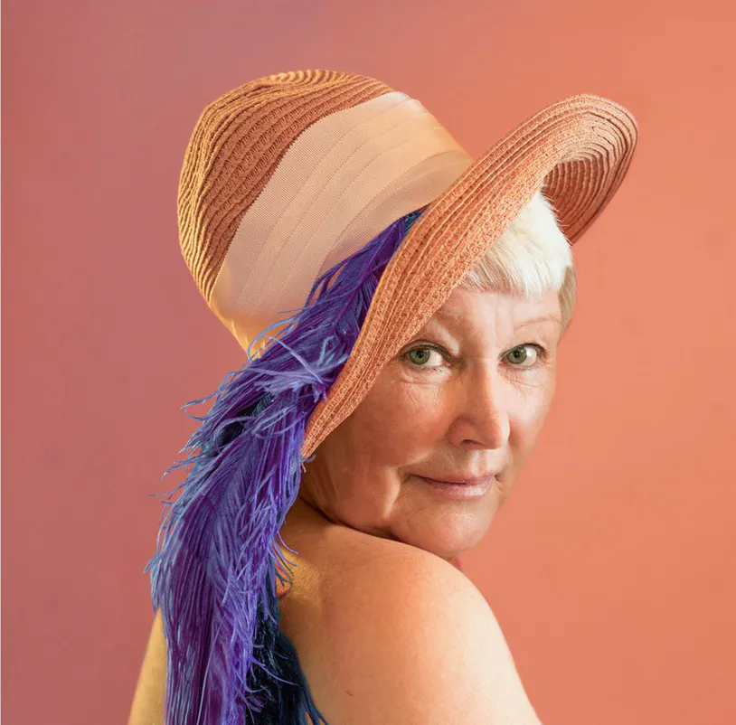
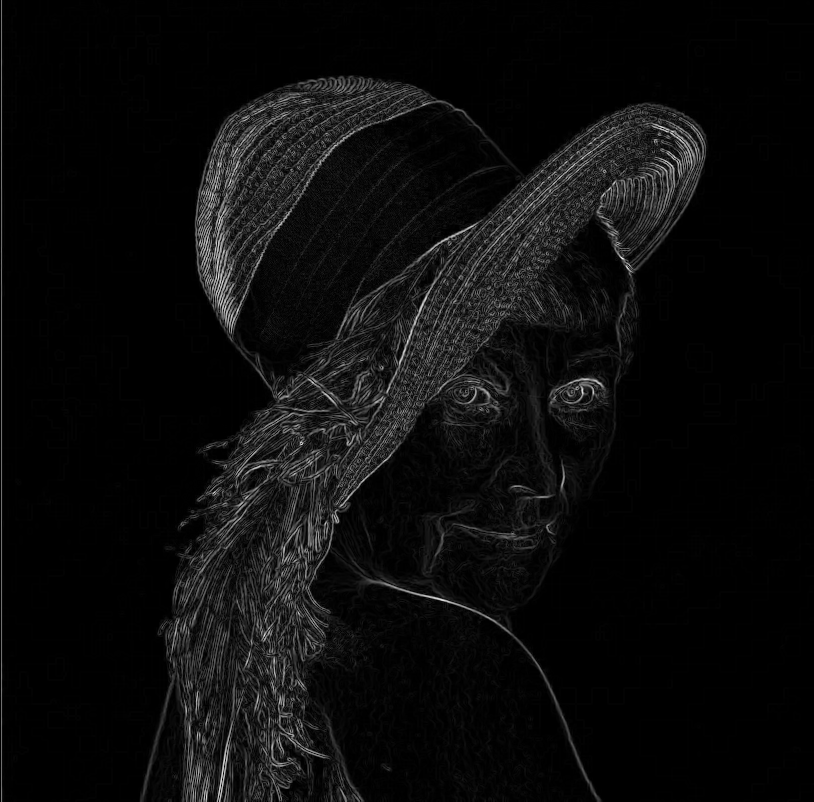

# Проект: Фильтр Собеля - реализация и сравнение

**Цель работы:** Научиться реализовывать алгоритм обработки изображений - фильтр Собеля.

**Задание:**

1. Реализовать базовый алгоритм в 2 вариантах: с использованием встроенных функций (OpenCV) и нативно на Python (NumPy).
2. Сравнить быстродействие реализованных вариантов.
3. Сделать отчёт в виде README.

---

## Содержание отчёта

1. Теоретическая база
2. Описание разработанной системы (алгоритмы, принципы работы, архитектура)
3. Результаты работы и тестирования системы (скриншоты, изображения, графики, закономерности)
4. Выводы по работе
5. Использованные источники

---

## 1. Теоретическая база

Фильтр Собеля - оператор для выделения границ на изображении. Он аппроксимирует градиенты яркости по двум ортогональным направлениям (горизонтальному и вертикальному) с помощью двумерных свёрток с ядрами размера обычно 3×3.

Ядра Собеля:

```
Gx = [[-1, 0, 1],
      [-2, 0, 2],
      [-1, 0, 1]]

Gy = [[-1, -2, -1],
      [ 0,  0,  0],
      [ 1,  2,  1]]
```

После применения свёрток получают горизонтальную компоненту градиента `Ix` и вертикальную `Iy`. Модуль градиента приближенно вычисляют как `sqrt(Ix**2 + Iy**2)` или как `|Ix| + |Iy|` (быстрее).

---

## 2. Описание разработанной системы

### 2.1 Что входит в репозиторий / README

* `utils.py` - функции для загрузки/сохранения изображений и бенчмаркинга.
* `sobel.py` - скрипт, содержащий две реализации (OpenCV и нативную на NumPy/Python).
* `main.py` - запуск алгоритмов, сохранение результатов и построение графика времени.
* `requirements.txt` - список зависимостей.
* `data/` - папка с тестовым изображением и результатами.

> В этом документе приведены инструкции по запуску и сам код (см. раздел «Как запустить»).

### 2.2 Алгоритмы и принципы работы

**Вариант A - OpenCV**

* Используется `cv2.Sobel` для вычисления производной по X и Y с последующим комбинированием в модуль градиента.
* Преимущества: оптимизированные C/C++ реализации, использование SIMD, многопоточность.

**Вариант B - Нативная реализация (NumPy + чистые циклы/векторизация)**

* Преобразование изображения в градации серого.
* Паддинг (отражение краёв или нулевой) и явная свёртка с ядрами `Gx` и `Gy`.
* Комбинация компонент в итоговое изображение.
* Мы даём две версии нативного варианта: (1) полностью на циклах, (2) частично векторизованная версия с использованием срезов NumPy (быстрее чем чистые циклы).

### 2.3 Архитектура кода

* `load_image(path) -> np.ndarray` - загрузка и преобразование в gray float32 [0..255].
* `sobel_opencv(img)` - возвращает изображение градиентов (uint8) и время выполнения.
* `sobel_native_loops(img)` - нативная реализация через вложенные циклы.
* `sobel_native_vectorized(img)` - векторизованная версия на NumPy (с использованием сдвигов/срезов).
* `benchmark(funcs, img, runs=10)` - прогоняет каждую функцию `runs` и возвращает среднее время и стандартное отклонение.

---

## 3. Результаты работы и тестирования системы

Исходное изображение:



После прохождение через фильтр Собеля:



Время выполнения реализаций:

| Реализация        | Время | Mean std |
|-------------------|-------|----------|
| opencv            | 0.011 | 0.0004   |
| native_loops      | 5.4   | 0.4      |
| native_vectorized | 0.02  | 0.0013   |

Полученные закономерности:

* OpenCV-реализация в десятки раз быстрее чистых Python-циклов и конкурентоспособна с векторизованной NumPy-реализацией.
* Нативная векторизованная версия даёт компромисс между читаемым кодом и производительностью.

---

## 4. Выводы по работе

* Алгоритм Собеля прост для реализации; ключевое влияние на производительность оказывают:
  * использование оптимизированных библиотек (OpenCV),
  * степень векторизации и использование ограниченных циклов в NumPy,
  * размер изображения (чем больше - тем сильнее выигрыш у C/C++ реализаций).
* Для практических задач обработки изображений рекомендовано использовать OpenCV, если важна скорость. Для учебных целей - реализовать нативно, чтобы увидеть механику свёртки.

---

## 5. Использованные источники

* Документация [OpenCV](https://docs.opencv.org/4.x/d2/d2c/tutorial_sobel_derivatives.html).

---

## Как запустить (пример)

1. Создайте виртуальное окружение и установите зависимости:

```bash
python -m venv venv
source venv/bin/activate   # Linux/macOS
venv\Scripts\activate     # Windows
pip install -r requirements.txt
```

2. Запустите работу через `make`:

```bash
make lab1
```

Скрипт сгенерирует и сохранит:

* `output_opencv.png` - результат OpenCV
* `output_native_loops.png` - результат нативной реализации с циклами
* `output_native_vectorized.png` - результат векторизованной реализации
* `benchmark_times.png` - график сравнения времени выполнения
* `benchmark_results.csv` - таблица с результатами тестов