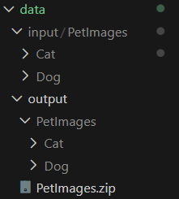

# Классификация

**Цель работы:**

Научиться создавать простые системы классификации изображений на основе сверточных 
нейронных сетей.

**Задание:**
1. Выбрать цель для задачи классификации и датасет (train/val: собрать либо найти, например, на Kaggle, test: собрать, разметить, не менее 50 изображений).
2. Зафиксировать архитектуру сети, loss, метрики качества.
3. Натренировать (либо дотренировать сеть) на выбранном датасете.
4. Оценить качество работы по выбранной метрике на валидационной выборке, определить, не переобучилась ли модель.
5. Сделать отчёт в виде readme на GitHub, там же должен быть выложен исходный код.

**Отчёт должен содержать следующие пункты:**
1. Теоретическая база
2. Описание разработанной системы (алгоритмы, принципы работы, архитектура, системные требования)
3. Результаты работы и тестирования системы (скриншоты, изображения, графики, закономерности)
4. Выводы по работе
5. Использованные источники

**Описание**

Необходимо реализовать простейшую систему классификации изображений на основе сверточных нейронных сетей. Возможно использовать любые доступные технологии, рекомендованный список такой:
• Google Colab для запуска (можно другую платформу или локальную машину)
• PyTorch
• Torchvision

---

## 1. Теоретическая база

Свёрточная нейронная сеть принимает на вход изображение с фиксированным размером и выполняет алгоритм свёртки, проходясь по изображению окном (ядром), с заданным шагом. Для выполнения задачи классификации применяются линейные слои на вход которым приходят вытянутые в вектор свёртки.

---

## 2. Описание разработанной системы

### 2.1 Что входит в репозиторий / README

* `utils.py` - функции для загрузки/сохранения изображений.
* `main.py` - запуск алгоритмов, сохранение результатов и построение графиков.
* `requirements.txt` - список зависимостей.
* `data/` - папка с тестовым изображением и результатами.

> З.Ы. В этом документе приведены инструкции по запуску и сам код (см. раздел «Как запустить»).

### 2.2 Алгоритмы и принципы работы

**SimpleCNN**

Реализация простой свёрточной модели для задачи бинарной классификации. На выходе модель возвращает число от 0 до 1, если число больше 0.5, то 1, меньше 0.

**CustomResNet50**

Дообученная ResNet50 с другим слоем классификации:

```python
# Кастомный avgpool
self.backbone.avgpool = nn.Sequential(
    nn.AdaptiveAvgPool2d((1, 1)),
    nn.Flatten()
)

in_features = self.backbone.fc.in_features

# Кастомный классификатор
self.backbone.fc = nn.Sequential(
    nn.Linear(in_features, 256),
    nn.ReLU(),
    nn.Dropout(0.2),
    nn.Linear(256, 128),
    nn.ReLU(),
    nn.Linear(128, 1)
)
```

Для того, чтобы максимизировать качество предсказания, мы загружаем предобученную на ImageNet-1K ResNet50. Таким образом, модель уже способна извлекать ценные артефакты на изображениях. Мы обучаем только последний слой, чтобы подогнать модель под нашу задачу.

### 2.3 Архитектура кода

* `utils.get_dataloaders` - загрузка данных и формирование DataLoader для train, val, test.
* `sobel_opencv(img)` - возвращает изображение градиентов (uint8) и время выполнения.
* `sobel_native_loops(img)` - нативная реализация через вложенные циклы.
* `sobel_native_vectorized(img)` - векторизованная версия на NumPy (с использованием сдвигов/срезов).
* `benchmark(funcs, img, runs=10)` - прогоняет каждую функцию `runs` и возвращает среднее время и стандартное отклонение.

> З.Ы. Структура папок должна быть как на изображении:
>
> 
---

## 3. Результаты работы и тестирования системы

Исходное изображение:


После прохождение через фильтр Собеля:


Время выполнения реализаций:

| Реализация        | Время | Mean std |
|-------------------|-------|----------|
| opencv            | 0.011 | 0.0004   |
| native_loops      | 5.4   | 0.4      |
| native_vectorized | 0.02  | 0.0013   |

Полученные закономерности:

* OpenCV-реализация в десятки раз быстрее чистых Python-циклов и конкурентоспособна с векторизованной NumPy-реализацией.
* Нативная векторизованная версия даёт компромисс между читаемым кодом и производительностью.

---

## 4. Выводы по работе

* Алгоритм Собеля прост для реализации; ключевое влияние на производительность оказывают:
  * использование оптимизированных библиотек (OpenCV),
  * степень векторизации и использование ограниченных циклов в NumPy,
  * размер изображения (чем больше - тем сильнее выигрыш у C/C++ реализаций).
* Для практических задач обработки изображений рекомендовано использовать OpenCV, если важна скорость. Для учебных целей - реализовать нативно, чтобы увидеть механику свёртки.

---

## 5. Использованные источники

* Документация [OpenCV](https://docs.opencv.org/4.x/d2/d2c/tutorial_sobel_derivatives.html).

---

## Как запустить (пример)

1. Создайте виртуальное окружение и установите зависимости:

```bash
python -m venv .venv
source .venv/bin/activate    # Linux/macOS
# .venv\Scripts\activate     # Windows
cd lab3
pip install -r requirements.txt
pip install torch torchvision --index-url https://download.pytorch.org/whl/cpu        # Если CPU
# pip install torch torchvision --index-url https://download.pytorch.org/whl/cu126    # Если GPU (см. https://pytorch.org/get-started/locally/)
sudo apt install graphviz    # Для визуализации Linux (Windows - https://graphviz.gitlab.io/download/)
```

2. Запустите работу через `make`:

```bash
make lab3
```

Скрипт сгенерирует и сохранит:

* `output_opencv.png` - результат OpenCV
* `output_native_loops.png` - результат нативной реализации с циклами
* `output_native_vectorized.png` - результат векторизованной реализации
* `benchmark_times.png` - график сравнения времени выполнения
* `benchmark_results.csv` - таблица с результатами тестов