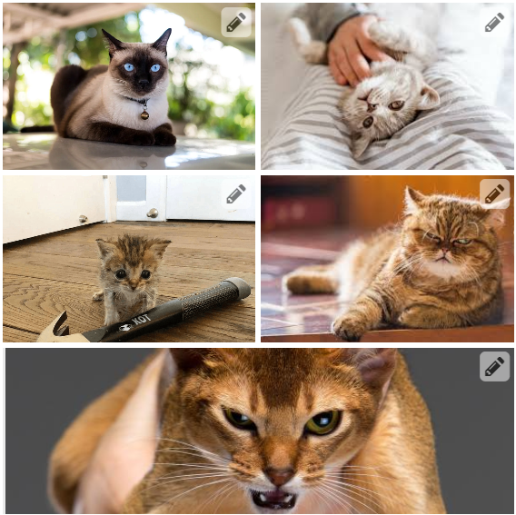
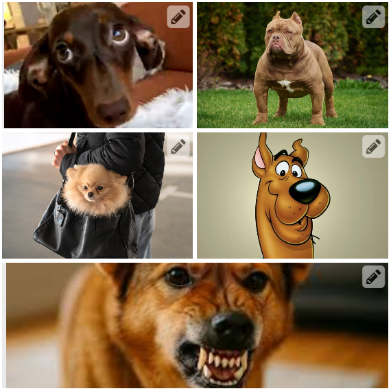
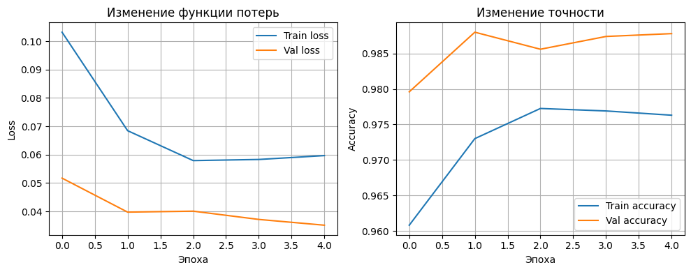
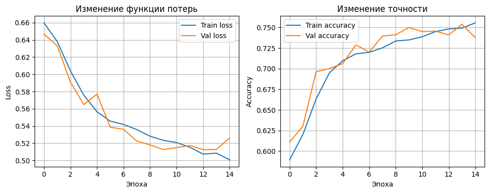

# Классификация

**Цель работы:**

Научиться создавать простые системы классификации изображений на основе сверточных 
нейронных сетей.

**Задание:**
1. Выбрать цель для задачи классификации и датасет (train/val: собрать либо найти, например, на Kaggle, test: собрать, разметить, не менее 50 изображений).
2. Зафиксировать архитектуру сети, loss, метрики качества.
3. Натренировать (либо дотренировать сеть) на выбранном датасете.
4. Оценить качество работы по выбранной метрике на валидационной выборке, определить, не переобучилась ли модель.
5. Сделать отчёт в виде readme на GitHub, там же должен быть выложен исходный код.

**Отчёт должен содержать следующие пункты:**
1. Теоретическая база
2. Описание разработанной системы (алгоритмы, принципы работы, архитектура, системные требования)
3. Результаты работы и тестирования системы (скриншоты, изображения, графики, закономерности)
4. Выводы по работе
5. Использованные источники

**Описание**

Необходимо реализовать простейшую систему классификации изображений на основе сверточных нейронных сетей. Возможно использовать любые доступные технологии, рекомендованный список такой:
• Google Colab для запуска (можно другую платформу или локальную машину)
• PyTorch
• Torchvision

---

## 1. Теоретическая база

Свёрточная нейронная сеть принимает на вход изображение с фиксированным размером и выполняет алгоритм свёртки, проходясь по изображению окном (ядром), с заданным шагом. Для выполнения задачи классификации применяются линейные слои на вход которым приходят вытянутые в вектор свёртки.

---

## 2. Описание разработанной системы

### 2.1 Что входит в репозиторий / README

* `utils.py` - функции для загрузки/сохранения изображений.
* `main.py` - запуск алгоритмов, сохранение результатов и построение графиков.
* `requirements.txt` - список зависимостей.
* `data/` - папка с тестовым изображением и результатами.

> З.Ы. В этом документе приведены инструкции по запуску и сам код (см. раздел «Как запустить»).

### 2.2 Алгоритмы и принципы работы

**SimpleCNN**

Реализация простой свёрточной модели для задачи бинарной классификации. На выходе модель возвращает число от 0 до 1, если число больше 0.5, то 1, меньше 0.

**CustomResNet50**

Дообученная ResNet50 с другим слоем классификации:

```python
# Кастомный avgpool
self.backbone.avgpool = nn.Sequential(
    nn.AdaptiveAvgPool2d((1, 1)),
    nn.Flatten()
)

in_features = self.backbone.fc.in_features

# Кастомный классификатор
self.backbone.fc = nn.Sequential(
    nn.Linear(in_features, 256),
    nn.ReLU(),
    nn.Dropout(0.2),
    nn.Linear(256, 128),
    nn.ReLU(),
    nn.Linear(128, 1)
)
```

Для того, чтобы максимизировать качество предсказания, мы загружаем предобученную на ImageNet-1K ResNet50. Таким образом, модель уже способна извлекать ценные артефакты на изображениях. Мы обучаем только последний слой, чтобы подогнать модель под нашу задачу.

### 2.3 Архитектура кода

* `utils.get_dataloaders` - загрузка данных и формирование `DataLoader` для `train`, `val`, `test`.
* `utils.train_model` - функция для обучения модели. Возвращает списки с ошибками и метриками.
* `utils.evaluate` - оценивает качество модели.
* `utils.visualize_losses_metrics` - визуализирует графики ошибок и метрик.
* `models.CustomResNet50` - модель `ResNet50` с кастомным классификатором.
* `models.SimpleCNN` - простая `CNN` модель.

> З.Ы. Структура папок должна быть как на изображении:
>
> 
---

## 3. Результаты работы и тестирования системы

Примеры собранных изображений:

- Cats:



- Dogs:



Результаты работы :

| Реализация        | Loss | Accuracy |
|-------------------|------|----------|
| CustomResNet50    | 0.17 | 0.96     |
| SimpleCNN         | 0.74 | 0.53     |

Графики обучения:

- CustomResNet50:



- SimpleCNN:



---

## 4. Выводы по работе

* Дообучение ResNet50 является хорошей практикой для построения Baseline.
* После получения результатов от Baseline, можно принимать решение нужно ли дальше усложнять модель или нет.
* Построение графиков ошибки и метрик качества при обучении позволяет отслеживать - переобучилась ли модель.

---

## 5. Использованные источники

* [Датасет](https://www.kaggle.com/datasets/bhavikjikadara/dog-and-cat-classification-dataset/data).
* [CustomResNet50](https://www.kaggle.com/code/jasminemohamed2545/dog-vs-cat-resnet50-98-3-acc#2.-Loading-and-Processing-Data).

---

## Как запустить (пример)

1. Создайте виртуальное окружение и установите зависимости:

```bash
python -m venv .venv
source .venv/bin/activate    # Linux/macOS
# .venv\Scripts\activate     # Windows
cd lab3
pip install -r requirements.txt
pip install torch torchvision --index-url https://download.pytorch.org/whl/cpu        # Если CPU
# pip install torch torchvision --index-url https://download.pytorch.org/whl/cu126    # Если GPU (см. https://pytorch.org/get-started/locally/)
# sudo apt install graphviz    # Для визуализации Linux (Windows - https://graphviz.gitlab.io/download/)
```

2. Запустите работу через `make`:

```bash
make lab3
```

Скрипт сгенерирует и сохранит:


* В output будет выведен процесс обучения и метрики качества.
* `graph_vis_simplecnn.png` - графики ошибок и метрики при обучении для SimpleCNN.
* `graph_vis_customresnet50.png` - графики ошибок и метрики при обучении для CustomResNet50.